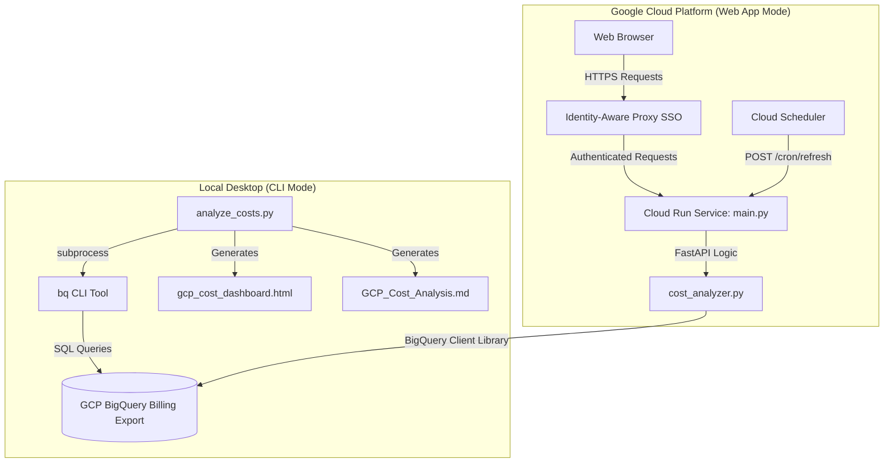

# 📊 GCP Project Cost Analyzer

A premium, state-of-the-art interactive billing dashboard and cost analysis generator for Google Cloud Platform (GCP). It transforms raw BigQuery billing exports into a stunning, responsive HTML dashboard with dual-axis trends, service/SKU breakdowns, and deep 60-day interactive daily charts.

Additionally, it provides a clean, fully compiled Markdown report suitable for email summaries, documentation, or GitHub releases.

---

## ✨ Features

- **Double-Engine Versatility:** 
  1. **Zero-Dependency CLI (`analyze_costs.py`):** Runs instantly using only the Python standard library and delegates BigQuery queries to your local `bq` CLI tool. No `pip install` required!
  2. **Production Web Application (`main.py`):** Powered by FastAPI and the official `google-cloud-bigquery` library, designed to be deployed to Google Cloud Run with single-click SSO (IAP) integration.
- **Visual Excellence:** Generates a clean, responsive dashboard in a Google Material 3 light theme (Hanken Grotesk + Inter), featuring white surface cards, hover micro-animations, and animated interactive charts (powered by Chart.js).
- **60-Day Drilldowns:** Expand any project card to view an interactive daily spending snapshot over the last 60 days, filterable by individual GCP Service or Billing SKU.
- **Resource-Level Attribution:** pinpoints individual cloud resources (VMs, Cloud SQL databases, Cloud Storage buckets) driving your expenditures.
- **Auto-Refresh Ready:** Standard endpoints support Cloud Scheduler cron-jobs to automatically refresh cached data daily.

---

## 🏛️ Architecture



---

## 📋 Prerequisites & Setup

Before running or deploying the analyzer, you must configure your GCP environment to export billing data to BigQuery.

### 1. Enable Cloud Billing Export to BigQuery
Google Cloud does not export billing details to BigQuery by default. To enable it:
1. Go to the **Google Cloud Console**.
2. Navigate to **Billing** > **Billing export**.
3. Under the **BigQuery export** tab, click **Edit settings** for **Standard usage cost** and **Detailed cost** (Resource-level).
4. Select a target **GCP Project** and create or select a **BigQuery Dataset** (e.g., `billing_exports`).
5. Save settings. 

> [!IMPORTANT]
> - Standard cost export starts populating data immediately.
> - Detailed cost (Resource-level) export includes resource IDs (e.g., individual VM names) and may take up to 24 hours to begin generating tables in BigQuery.
> - Tables are named:
>   - Standard: `gcp_billing_export_v1_<BILLING_ACCOUNT_ID>`
>   - Resource-level: `gcp_billing_export_resource_v1_<BILLING_ACCOUNT_ID>`

### 2. IAM Permissions Required
The authenticated user or service account executing the analyzer must possess:
- **`roles/bigquery.dataViewer`** (BigQuery Data Viewer) on the BigQuery dataset containing the billing export tables.
- **`roles/bigquery.jobUser`** (BigQuery Job User) on the project where queries will be executed (usually the active `gcloud` project).

---

## 🚀 Usage 1: Zero-Dependency CLI (`analyze_costs.py`)

No Python libraries to install! Simply authenticate with `gcloud` and run the script.

### Authentication
Ensure your local `gcloud` CLI is logged in and configured to the correct project:
```bash
gcloud auth login
gcloud config set project YOUR_BILLING_PROJECT_ID
```

### Run Command
```bash
python3 analyze_costs.py \
  --project YOUR_BILLING_PROJECT_ID \
  --dataset YOUR_DATASET_NAME \
  --month YYYYMM \
  --output-dir ./reports
```

### CLI Arguments
| Argument | Short | Default | Description |
|---|---|---|---|
| `--project` | `-p` | Active `gcloud` project | GCP Project ID where the BigQuery billing dataset resides |
| `--dataset` | `-d` | `billing_exports` | BigQuery billing export dataset name |
| `--month` | `-m` | Previous calendar month | Invoice month to analyze in `YYYYMM` format (e.g., `202605` for May 2026) |
| `--output-dir` | `-o` | `.` | Directory to save the generated `.html` and `.md` outputs |

---

## 🌐 Usage 2: Production Web Application (`main.py`)

The application includes a FastAPI server (`main.py`) that serves the cost analyzer as a fast-loading web app. It caches BigQuery query responses in a local `/tmp` file for up to 24 hours, guaranteeing sub-second response times for users.

### Local Development
To run the server locally, install dependencies and start Uvicorn:
```bash
# Set up a virtual environment (optional but recommended)
python3 -m venv .venv
source .venv/bin/activate

# Install dependencies
pip install -r requirements.txt

# Point the app at your billing export, then start Uvicorn.
# GCP_PROJECT  = project holding the BigQuery billing export
# GCP_DATASET  = billing export dataset name (whatever you named it; often singular)
export GCP_PROJECT="my-billing-project"
export GCP_DATASET="billing_export"
uvicorn main:app --reload --host 127.0.0.1 --port 8080
```
Open your browser and navigate to `http://127.0.0.1:8080` to interact with your dashboard. Authenticate locally with `gcloud auth application-default login` so the BigQuery client can read your billing data.

### Cloud Run Deployment
Deployment is fully automated and **project-agnostic** — everything is configured via environment variables (or a `.env` file), so the same script works for anyone, in any project. The service scales to **zero instances** when idle, for virtually **$0/month infrastructure cost**.

```bash
cp .env.example .env     # then edit .env with your project details
./deploy.sh
```

`deploy.sh` enables the required APIs, creates a least-privilege runtime service account, grants it read access to your billing data (even in a **different project**), builds the image, deploys to Cloud Run, and — unless you opt out — turns on IAP.

#### Configuration (`.env`)
| Variable | Default | Description |
|---|---|---|
| `PROJECT_ID` | _(required)_ | Project the Cloud Run service is deployed to |
| `BILLING_PROJECT_ID` | = `PROJECT_ID` | Project that holds the BigQuery billing export (set when it differs) |
| `BILLING_DATASET` | `billing_export` | Billing export dataset name (as you named it in Billing → Billing export) |
| `REGION` | `us-central1` | Cloud Run region |
| `SERVICE_NAME` | `gcp-cost-analyzer-app` | Cloud Run service name |
| `RUNTIME_SA_NAME` | `cost-analyzer-run` | Dedicated runtime service account (created in `PROJECT_ID`) |
| `ENABLE_IAP` | `true` | `true` = private + IAP; `false` = public |
| `IAP_MEMBERS` | _(empty)_ | Comma-separated principals granted access, e.g. `user:a@b.com,domain:example.com` |

> [!NOTE]
> **Cross-project billing** is fully supported. If your billing export lives in a separate project (common for org-wide billing), set `BILLING_PROJECT_ID` to that project. The deploy script grants the runtime service account `roles/bigquery.jobUser` + `roles/bigquery.dataViewer` there automatically. The web app reads `GCP_PROJECT` (billing project) and `GCP_DATASET` at runtime.

### 🔒 Security & SSO via IAP (on by default)
With `ENABLE_IAP=true`, the service is deployed **privately** (no public access) and secured with **direct Cloud Run Identity-Aware Proxy** — no load balancer, domain, or SSL certificate required. It keeps the `*.run.app` URL and enforces Google SSO on every request. The app reads the IAP header `X-Goog-Authenticated-User-Email` to display and log which user is viewing the dashboard.

**Share access with people** (anytime, without redeploying) using `share.sh`:
```bash
./share.sh add    user:alice@example.com     # grant a person
./share.sh add    group:finance@example.com  # grant a Google Group
./share.sh add    domain:example.com         # grant an entire Workspace domain
./share.sh remove user:alice@example.com     # revoke
./share.sh list                              # see who has access
```
Principals can also be granted at deploy time via `IAP_MEMBERS` in `.env`. IAM changes take 1–3 minutes to propagate.

> [!TIP]
> Prefer the traditional external HTTPS Load Balancer + Serverless NEG + IAP setup (e.g. to serve on a custom domain)? Set `ENABLE_IAP=false`, set the service ingress to `internal-and-cloud-load-balancing`, and front it with an ALB that has IAP enabled on its backend service.

### 🔄 Automatic Daily Data Refreshes
Configure a **Cloud Scheduler** job to trigger cache regeneration automatically:
- **Frequency:** Once a day (e.g., `0 6 * * *` - 6 AM daily).
- **Target URL:** `https://<YOUR_APP_URL>/cron/refresh`
- **HTTP Method:** `GET`

---

## 🧭 Dashboard Views & Filters

The dashboard is a single-page app with a **left sidebar** that switches between four views (the active view is remembered in the URL hash):

| View | Contents |
|---|---|
| **Overview** | A **period summary band** (analyzed month, covered date range, days with spend, daily average, projected month-end run-rate, and Δ vs the previous month) plus the headline metric cards, project/service share doughnuts, the month-over-month trend, and cost-optimization insights. |
| **Spending Tracker** | A full-width **daily spend** chart with a **7-day moving-average** overlay; range presets (7/14/30/60 days), custom start/end dates, and **drag-to-zoom**; stat cards (period total, daily average, peak day, 30-day run-rate); and a **Top Movers** list (last 7 days vs the prior 7 days). |
| **Projects** | The per-project **deep-dive accordions** (daily charts per project) with a live project filter. |
| **Services & SKUs** | The Top-25 SKU table with **live search** and a **project filter**. |

All views, filters, the tracker, and the summary are computed **client-side** from the data already embedded in the page — no extra BigQuery queries — so everything stays instant and works from the cached HTML. The layout collapses the sidebar into a horizontal bar on small screens.

---

## 🎨 Dashboard Design Aesthetics

The interface follows a clean **Google Material 3 light theme**, aligned with the companion [talent-scraper](https://github.com/duboc/talent-scraper) project:
- **Material 3 palette:** A bright `#f8f9fa` canvas with white surfaces, a Google-blue (`#1a73e8`) primary, and Google brand accents (blue/green/yellow/red) used across charts.
- **Typography:** **Hanken Grotesk** for headings, **Inter** for body text, and **JetBrains Mono** for figures — loaded from Google Fonts.
- **Surfaces & elevation:** Solid white cards with hairline borders and soft Material shadows (no glassmorphism), plus a fixed top navbar.
- **Micro-interactions:** Smooth hover/elevation transitions on buttons, cards, and accordion expansions.
- **Responsive Layout:** Flex/grid layouts adapt automatically across mobile, tablet, and wide desktop displays.

---

## 📄 License

This project is open-source and licensed under the [MIT License](LICENSE).
