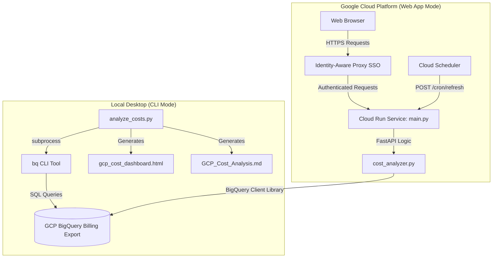

# 📊 GCP Project Cost Analyzer

A premium, state-of-the-art interactive billing dashboard and cost analysis generator for Google Cloud Platform (GCP). It transforms raw BigQuery billing exports into a stunning, responsive HTML dashboard with dual-axis trends, service/SKU breakdowns, and deep 60-day interactive daily charts.

Additionally, it provides a clean, fully compiled Markdown report suitable for email summaries, documentation, or GitHub releases.

---

## ✨ Features

- **Double-Engine Versatility:** 
  1. **Zero-Dependency CLI (`analyze_costs.py`):** Runs instantly using only the Python standard library and delegates BigQuery queries to your local `bq` CLI tool. No `pip install` required!
  2. **Production Web Application (`main.py`):** Powered by FastAPI and the official `google-cloud-bigquery` library, designed to be deployed to Google Cloud Run with single-click SSO (IAP) integration.
- **Visual Excellence:** Generates a premium dark-themed, responsive dashboard featuring Glassmorphism styling, hover-triggered micro-animations, and animated interactive charts (powered by Chart.js).
- **60-Day Drilldowns:** Expand any project card to view an interactive daily spending snapshot over the last 60 days, filterable by individual GCP Service or Billing SKU.
- **Resource-Level Attribution:** pinpoints individual cloud resources (VMs, Cloud SQL databases, Cloud Storage buckets) driving your expenditures.
- **Auto-Refresh Ready:** Standard endpoints support Cloud Scheduler cron-jobs to automatically refresh cached data daily.

---

## 🏛️ Architecture



---

## 📋 Prerequisites & Setup

Before running or deploying the analyzer, you must configure your GCP environment to export billing data to BigQuery.

### 1. Enable Cloud Billing Export to BigQuery
Google Cloud does not export billing details to BigQuery by default. To enable it:
1. Go to the **Google Cloud Console**.
2. Navigate to **Billing** > **Billing export**.
3. Under the **BigQuery export** tab, click **Edit settings** for **Standard usage cost** and **Detailed cost** (Resource-level).
4. Select a target **GCP Project** and create or select a **BigQuery Dataset** (e.g., `billing_exports`).
5. Save settings. 

> [!IMPORTANT]
> - Standard cost export starts populating data immediately.
> - Detailed cost (Resource-level) export includes resource IDs (e.g., individual VM names) and may take up to 24 hours to begin generating tables in BigQuery.
> - Tables are named:
>   - Standard: `gcp_billing_export_v1_<BILLING_ACCOUNT_ID>`
>   - Resource-level: `gcp_billing_export_resource_v1_<BILLING_ACCOUNT_ID>`

### 2. IAM Permissions Required
The authenticated user or service account executing the analyzer must possess:
- **`roles/bigquery.dataViewer`** (BigQuery Data Viewer) on the BigQuery dataset containing the billing export tables.
- **`roles/bigquery.jobUser`** (BigQuery Job User) on the project where queries will be executed (usually the active `gcloud` project).

---

## 🚀 Usage 1: Zero-Dependency CLI (`analyze_costs.py`)

No Python libraries to install! Simply authenticate with `gcloud` and run the script.

### Authentication
Ensure your local `gcloud` CLI is logged in and configured to the correct project:
```bash
gcloud auth login
gcloud config set project YOUR_BILLING_PROJECT_ID
```

### Run Command
```bash
python3 analyze_costs.py \
  --project YOUR_BILLING_PROJECT_ID \
  --dataset YOUR_DATASET_NAME \
  --month YYYYMM \
  --output-dir ./reports
```

### CLI Arguments
| Argument | Short | Default | Description |
|---|---|---|---|
| `--project` | `-p` | Active `gcloud` project | GCP Project ID where the BigQuery billing dataset resides |
| `--dataset` | `-d` | `billing_exports` | BigQuery billing export dataset name |
| `--month` | `-m` | Previous calendar month | Invoice month to analyze in `YYYYMM` format (e.g., `202605` for May 2026) |
| `--output-dir` | `-o` | `.` | Directory to save the generated `.html` and `.md` outputs |

---

## 🌐 Usage 2: Production Web Application (`main.py`)

The application includes a FastAPI server (`main.py`) that serves the cost analyzer as a fast-loading web app. It caches BigQuery query responses in a local `/tmp` file for up to 24 hours, guaranteeing sub-second response times for users.

### Local Development
To run the server locally, install dependencies and start Uvicorn:
```bash
# Set up a virtual environment (optional but recommended)
python3 -m venv .venv
source .venv/bin/activate

# Install dependencies
pip install -r requirements.txt

# Start Uvicorn developer server
uvicorn main:app --reload --host 127.0.0.1 --port 8080
```
Open your browser and navigate to `http://127.0.0.1:8080` to interact with your dashboard.

### Cloud Run Deployment
Deploying to Google Cloud Run is fully automated. The application scales down to **zero instances** when idle, resulting in virtually **$0/month infrastructure cost**.

Run the deploy script:
```bash
GCP_PROJECT_ID="your-gcp-project-id" GCP_REGION="us-central1" ./deploy.sh
```

### 🔒 Enterprise Security & SSO Setup (Recommended)
To prevent unauthorized access to your billing details, secure the deployed Cloud Run service using **Google Identity-Aware Proxy (IAP)**:

1. **Restrict Cloud Run Access:** Update the ingress of your service to only accept traffic from a load balancer:
   ```bash
   gcloud run services update gcp-cost-analyzer-app \
     --ingress internal-and-cloud-load-balancing \
     --region us-central1
   ```
2. **Deploy an Application Load Balancer:**
   - Create a Serverless Network Endpoint Group (NEG) pointing to your `gcp-cost-analyzer-app` Cloud Run service.
   - Deploy an external HTTPS Application Load Balancer (ALB) and add this Serverless NEG as its backend.
3. **Enable Identity-Aware Proxy (IAP):**
   - Turn on IAP on the ALB backend service.
   - Grant the `roles/iap.httpsResourceAccessor` role to authorized users or groups.
   - The web app automatically reads the IAP header `X-Goog-Authenticated-User-Email` to audit and log which user is viewing the dashboard!

### 🔄 Automatic Daily Data Refreshes
Configure a **Cloud Scheduler** job to trigger cache regeneration automatically:
- **Frequency:** Once a day (e.g., `0 6 * * *` - 6 AM daily).
- **Target URL:** `https://<YOUR_APP_URL>/cron/refresh`
- **HTTP Method:** `GET`

---

## 🎨 Dashboard Design Aesthetics

The interface is built utilizing premium design aesthetics to deliver a sleek visual feel:
- **HSL Curated Palette:** Avoids harsh primitive colors. Employs deep obsidian and slate tones matched with vibrant emeralds and glowing indigos.
- **Glassmorphism panels:** Subtle borders, backing blurs (`backdrop-filter`), and fine shadows make components pop.
- **Micro-interactions:** Smooth scale and shadow transitions on button hover, element clicking, and card expansions.
- **Responsive Layout:** Responsive flex grids adapt automatically across mobile screens, tablets, and wide desktop displays.

---

## 📄 License

This project is open-source and licensed under the [MIT License](LICENSE).
